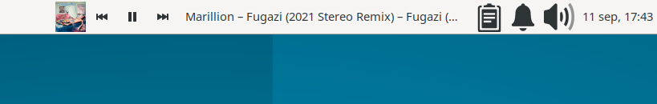
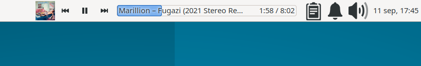
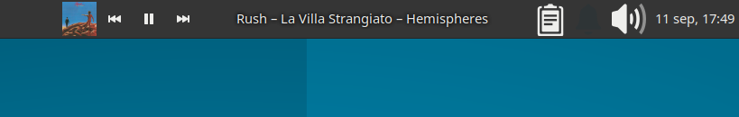
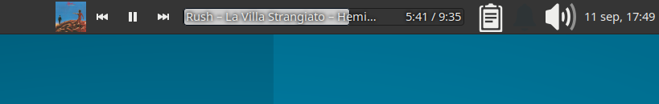
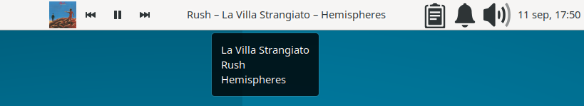
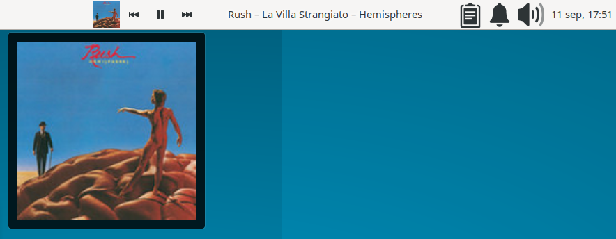
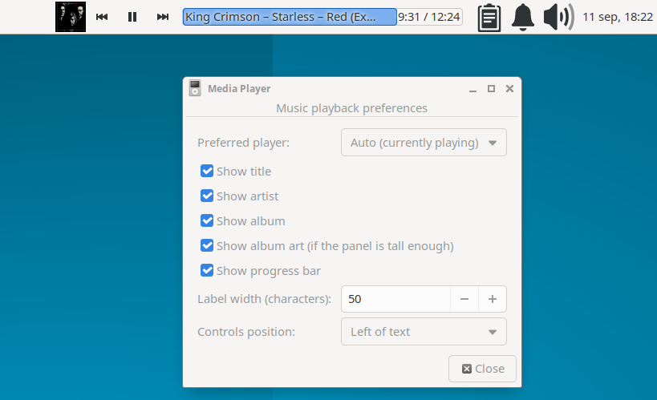

Xfce panel plugin that controls music playback over **MPRIS/D-Bus**. It works with any player that exposes the `org.mpris.MediaPlayer2` interface —such as Spotify, VLC, Rhythmbox, mpv, Firefox, Chrome, and others— with no per-application integration required.

> **⚠ Early development stage.** This plugin is under active development, has only been tested on a single machine/configuration (Ubuntu 26.04, Xfce 4.20), and doesn't yet have a stable release. Expect rough edges; treat the `.deb` file and the instructions below as subject to constant change, rather than as a finished product.

## Features

- Previous, play/pause, and next buttons, linked to the active MPRIS player.
- Track info with **title**, **artist**, **album**, and **cover art** fields that can be toggled independently.
- Play/pause by clicking the text.
- Playback progress indicators that can be toggled on or off.
- Colors that adapt to the current Xfce/GTK theme.
- Configurable width.
- Preferred player selection (or automatic).

## Installation

- There is a [.deb package](https://github.com/rod-farias/xfce4-mediaplayer-plugin/releases) for Xfce 4.20 on Ubuntu 26.04; it is not guaranteed to install correctly on other combinations.
- For other distributions: clone the repository, install the dependencies, and build with `make` as detailed [here](docs/DETAILS.md#building-and-installing).

Then right-click the panel → Panel → Add New Items… and add
"Media Player".

## Screenshots

- The plugin on light panel

- The plugin on light panel with progress bar

- The plugin on dark panel

- The plugin with progress bar on dark panel

- Hovering the text

- Hovering the art

* Preferences dialog

## Known limitations

- Album art is only loaded for `file://` URLs (which is what most desktop MPRIS players provide). Players that only provide a remote `http(s://)` URL for the cover art won't show a thumbnail.
- Playback position is not part of the MPRIS change-notification signal, so it is polled once a second while a track is playing; this is a deliberate, low-frequency D-Bus call, not continuous polling.
- Cannot be added to vertical panels. In that case, a small warning icon is shown instead of a deformed or broken interface.
